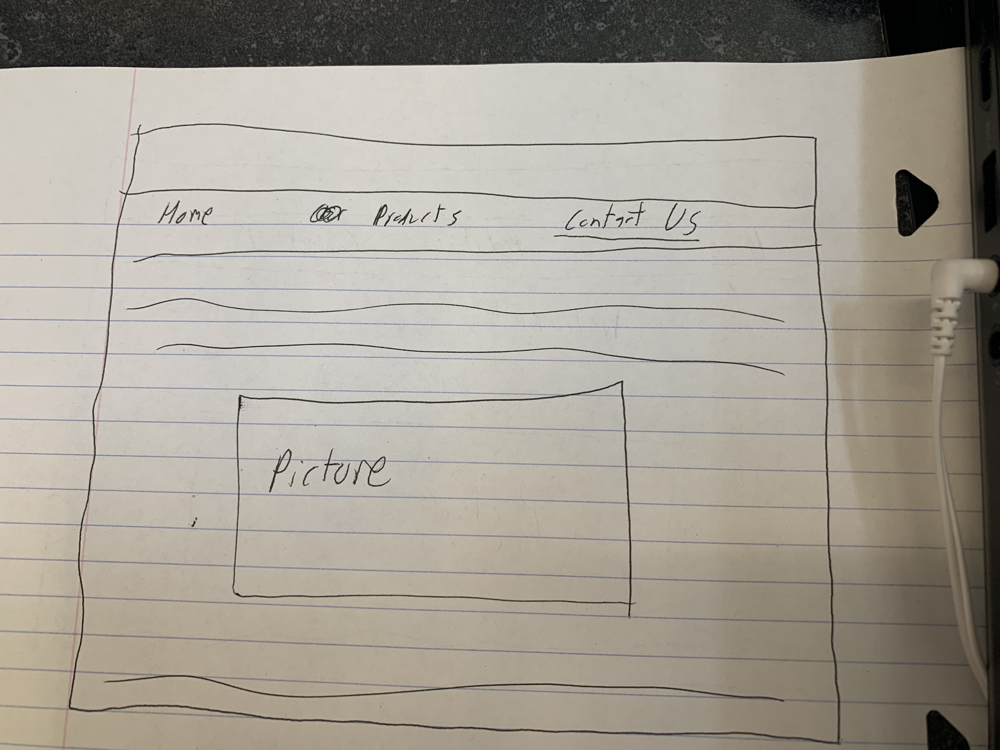

# Project 2: Design Journey

Your Name: [insert your name here]

**All images must be visible in Markdown Preview. No credit will be provided for images in your repository that are not properly linked in Markdown. Assume all file paths are case sensitive!**

# Project 2, Milestone 1 - Design, Plan, & Draft Website

## Describe your Catalog

[What will your collection be about? What types of attributes will you keep track of for the *things* in your collection? 1-2 sentences.]
My collection will be selection of sporting goods that can be bought online.
I will keep track of the price of each good, the quantity in stock, the estimated time it will take to ship, and the name of the good.

## Target Audiences

[Tell us about your target audience(s).]
My target audience is sports enthusiasts who want the ability to be able to buy quality sporting goods at the convienience of thie rhome without having to go to a sporting goods store.

## Design Process

[Document your design process. Show us the evolution of your design from your first idea (sketch) to design you wish to implement (sketch). Show us the process you used to organize content and plan the navigation (card sorting).]

[Label all images. All labels must be visible in Markdown Preview.]

## Final Design Plan

[Include sketches of your final design here.]

## Templates
I am going to use a header template and a footer template.
The header template will contain the navigation bar.
The footer template contains legal information over the use of brands such as Nike Adidas ,etc.
[Identify the templates you will use on your site.]

## Database Schema Design

[Describe the structure of your database. You may use words or a picture. A bulleted list is probably the simplest way to do this. Make sure you include constraints for each field.]

Table: movies
* field 1: description..., constraints...
* field...

Table: products
-id, integer type, constriants:  primary key, unique
this is the primary key and identifier for each datapoint
-product_name: text type, the name of the good in question  constraints: unique
-price: numeric type, the price of the good in question
-in_stock:integer type, the quantity of goods that can still be sold
-estimated_shipping: int type, the estimated amount of days it will take to ship anywhere in the continental US

## Database Query Plan

[Plan your database queries. You may use natural language, pseudocode, or SQL.]

1. All records
    SELECT * FROM products;
    for all elements in database products:
    print element

2. Search records
    make array of possible search categorys:
    searchcategories= {name,price, estimated shipping days, quantity in stock}
    search for product in the database according to searchcategories
        if product like searchcategory:
            print product

3. Insert record
 insert new product into database

 enter new product into the table if price >0 and name is not empty and desired stock > 0

## Code Planning

# Final Submission: Complete & Polished Website

## Reflection

I have improved from project 1 in that I have developed a greater understanding of how important it is to ensure that proper constraints

[Take this time to reflect on what you learned during this assignment. How have you improved since Project 1? What things did you have trouble with?]
