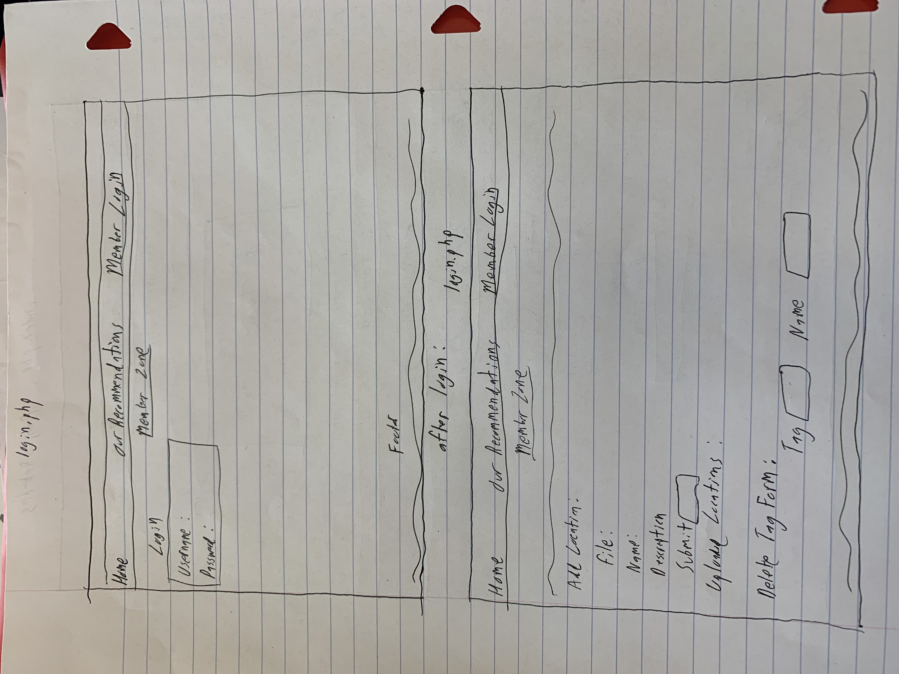

# Project 3: Design Journey

Your Name: Luis Lopez Cabrera

**All images must be visible in Markdown Preview. No credit will be provided for images in your repository that are not properly linked in Markdown. Assume all file paths are case sensitive!**


# Project 3, Milestone 1 - Design, Plan, & Draft Website

## Describe your Gallery
MY photo gallery will be for a natural appreciation society that seeks to give information and travel advice to individuals seeking to travel
to those sites. It will be a list of natursl wonders around the world with an image, name, and description that will be given to the audience
that will be recommended to travel enthusiasts.


## Target Audiences
One of my target audiences will be expert travelers who have already traveled the world and are fairly knowledgable about natural wonders.
They will be registered members of the appreciation society and as such will have login credentials in order to add recommended locations.
This audience is the one that will have the most access and use for this website.

My second target audience will be regular people who have an interest in visiting natural wonders but don't have much experience taveling to see them. They will usually be  travelers who will mostly be looking to look for places to visit. As such they will be the ones without login credentials.
[Tell us about your target two audiences. ~1-3 sentences per audience]


## Design Process

[Document your design process. Show us the evolution of your design from your first idea (sketch) to design you wish to implement (sketch). Show us the process you used to organize content and plan the navigation (e.g. card sorting).]


[Label all images. All labels must be visible in Markdown Preview.]


## Final Design Plan


[Include sketches of your final design here.]


## Templates
header and footer templates will be used.
[Identify the templates you will use on your site.]


## Database Schema Design

[Describe the structure of your database. You may use words or a picture. A bulleted list is probably the simplest way to do this. Make sure you include constraints for each field.]

[Hint: You probably need `users`, `images`, `tags`, and `image_tags` tables.]

[Hint: For foreign keys, use the singular name of the table + _id. For example: 1) `user_id` in the `images` table or 2) `image_id` and `tag_id` for the `image_tags` table.]

```
images (
id : INTEGER {PK, U, Not, AI} -- surrogate primary key
name : TEXT
location_name: TEXT NOT NULL
file_name: TEXT NOT NULL
file_ext: TEXT NOT NULL
description: TEXT
user_id INTEGER

...
)
```
```
tags (
id : INTEGER {PK, U, Not, AI} -- surrogate primary key
tag: TEXT NOT NULL UNIQUE
...
)

image_tags (
id : INTEGER {PK, U, Not, AI} -- surrogate primary key
image_id: TEXT NOT NULL
tag_id: TEXT NOT NULL
...
)
```
```
users (
id : INTEGER {PK, U, Not, AI} -- surrogate primary key
username: text unique not null
password: text  not null
)
...
```
```
sessions (
id : INTEGER {PK, U, Not, AI} -- surrogate primary key
user_id: INTEGER NOT NULL
session: TEXT NOT NULL UNIQUE
)
...

## Code Planning

[Plan what top level PHP pages you'll need.]
index.php, recommendations.php, login.php

[Plan what templates you'll need.]
header and footer template

[Plan any PHP code you'll need.]


```
function is_user_logged_in() {
  if user is logged in, return true
  otherwise, return false
}
```
function show_all_recommendations(locations) {
    use query string parameter to display every image in locations
    print location_name of locations
    print description of locations

  }

```
  function show_tags(tags) {

    print every tag in tags array

  }


## Database Query Plan

[Plan your database queries. You may use natural language, pseudocode, or SQL.]
//select all images in image table
```
SELECT * FROM images;
// select all tags in tags table
```
SELECT * FROM tags;
// search for image using inputted search and matching it to location_name
```
SELECT * FROM images WHERE location_name LIKE '%' || search || '%'";

//select all tags in an image given the location_name of image and checking if tag_id corrresponds with image_id in image_tags table
```
SELECT tags.tag FROM tags LEFT OUTER JOIN image_tags ON image_tags.tag_id=tags.id WHERE (SELECT id FROM images) WHERE location_name=search )=image_tags.image_id;

// given a tag, look at all the images tagged with that tag by checking if tag_id corresponds with any image_id and make a list of those images
```
SELECT images.id,images.location_name, images.file_name, images.file_ext, images.description FROM images LEFT OUTER JOIN image_tags ON image_tags.image_id=images.id LEFT OUTER JOIN tags ON image_tags.tag_id=tags.id WHERE tags.tag = search_tag;

// insert  a new tag that corresponds with an image in image_tags table
```
INSERT INTO image_tags (  image_id,tag_id ) VALUES (  new_image_id,new_tag_id);

// insert a new image into images table, include the id of the user that uploaded it
```
INSERT INTO images ( location_name,file_name, file_ext, description,user_id) VALUES ( location, :filename, extension, description,user_id);

// search for an image in image_table using inputted search  and check that the current user uploaded it, this will be used later to determine
if the current user can erase it//
```
SELECT * FROM images WHERE location_name = :locname AND user_id=user;

// delete image from image table if location_name is inputted search
```
DELETE FROM images WHERE location_name = :locname;
// delete image_tags record if it has image_id of image that is about to be deleted
```
DELETE FROM image_tags WHERE image_id = :delete_image_id;

// check if image was uploaded by current user
```
SELECT * FROM images WHERE user_id = :user_id;

// delete image_tags record if it has inputed image_id AND inputted tag_id
```
DELETE FROM image_tags WHERE image_id=:new_image_id AND tag_id=:new_tag_id ";

# Project 3, Milestone 2 - Gallery and User Access Controls

## Issues & Challenges
One of the main problems I had was being able to separate all the actions a logged in user could do that an anonymous user (or one not logged in) isn't supposed to do. I had orginally planned to make the login page be just for uploads, but it became easier to seperate all the stuff only a user could do in one webpage.

Another problem I had was figuring out whether or not to create one form for inputting new tags in an image and another one for placing existing ones. It seemed that two forms would be required given the fact that inserting a new one would require additional sql queries,
but a found a way to make one form utilizing checks and if statments.

Had an issue organzing my forms so that they wouldnt overlap with each other.

[Tell us about any issues or challenges you faced while trying to complete milestone 2. 2-4 sentences/bullet points]


# Final Submission: Complete & Polished Website

## Reflection

Working on project 3 has taught me that when planning is key when working on websites with lots of code. Because there is so much back-end to do in projects like these, planning is really helpful in insuring that what you are creating will fit project specifications.
I had previously not been much of a planner when making websites, believing that it was fine if I thought of planning the code as I was writng,
but this project has taught me how to aprreciate meticulous planning and plan ahead more often.

[Take this time to reflect on what you learned during this assignment. How have you improved since starting this class? 2-4 sentences]
